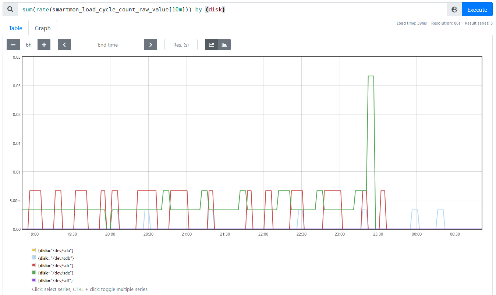

 It is [fairly well-known among techies](https://mobile.twitter.com/marcan42/status/1423974853955125250) that hard drives used in server-like workloads can suffer from poor configuration by default such that they [frequently load and unload their heads](https://superuser.com/questions/840851/how-much-load-cycle-count-can-my-hard-drive-hypotethically-sustain), which can cause disks to fail much faster than they otherwise would. While I have been aware of this in my home server as well, it is easy to forget to ensure that disks are not silently killing themselves by cycling the heads. Since I use [Prometheus](https://prometheus.io/) to capture information on the server's operation however, I can use that to monitor that my hard drives are doing well.

<!-- more -->

## Collecting SMART metrics

The [Prometheus Node Exporter](https://github.com/prometheus/node_exporter/) is the canonical tool for capturing machine metrics like utilization and hardware information with Prometheus, but it alone does not support probing SMART data from storage drives. It does support reading arbitrary metrics from text files written by other programs with its `textfile` collector however, which is fairly easy to integrate with arbitrary other tools.

[Smartmontools](https://www.smartmontools.org/) is the typical package of tools for reading SMART information from drives on Linux, and conveniently the [community-maintained example scripts](https://github.com/prometheus-community/node-exporter-textfile-collector-scripts) for collecting system information with Prometheus includes both a Python and shell script (`smartmon.sh` and `smartmon.py`) that generate metrics for all devices on a system that support SMART reporting. I run the shell script every 5 minutes with a systemd service triggered by a timer:

```ini
[Unit]
Description=Export smartctl metrics to Prometheus Node Exporter

[Service]
Nice=-10
ExecStart=/bin/sh -c 'exec /usr/local/bin/node_exporter_text_smartmon > /var/state/prometheus/smartctl.prom'
# Write nothing except the output file
ProtectSystem=strict
ReadWritePaths=/var/state/prometheus
# Shell needs a temp directory
PrivateTmp=true
ProtectHome=tmpfs
```

My node exporter is then configured to read text files from `/var/state/prometheus`, and Prometheus itself gathers metrics from the node exporter.

### Monitoring metrics

With the SMART metrics captured by Prometheus, it's fairly easy to write a query that will show how often a given disk is parking its heads. The `smartmon_load_cycle_count_value` metric seems like it would be the right one to query, but that actually expresses a percentage value (0-100) representing how many load cycles remain in the specified lifetime- on reaching 0 the disk has done a very large number of load cycles.

Somewhat more useful for monitoring is the `smartmon_load_cycle_count_raw_value`, which provides the actual number of load cycles that have been done. By taking the rate of those it becomes pretty easy to see which disks are loading and unloading most, so I choose to query with `sum(rate(smartmon_load_cycle_count_raw_value[6h])) by (disk)` to summarize by disk and get a 6-hour rolling average rate in load cycles per second, pictured here:


In this case, there are at least two disks that I probably need to configure, since `/dev/sde` seems to be parking as often as about every 4 minutes (0.004 Hz) and `/dev/sdc` is only parking slightly less often. `/dev/sdb` also seems worth inspecting.

## Preventing excessive parking

To prevent parking more often that is useful (for a server, usually that choice would be "very rarely"), there are a couple ways to do it and which apply will depend on what the hard drive vendor's firmware supports.

Of the three disks that I decided need some attention, I have one Western Digital disk and two Seagate ones. From the SMART data again, they are specifically these models:

* `/dev/sdc`: Seagate Archive HDD (SMR) ST8000AS0002-1NA17Z, firmware version RT17
* `/dev/sde`: Seagate IronWolf ST8000VN004-2M2101, firmware version SC60
* `/dev/sdb`: Western Digital Red WDC WD40EFRX-68N32N0, firmware version 82.00A82

### APM

The [APM specification](https://en.wikipedia.org/wiki/Advanced_Power_Management#In_ATA_drives) dating from 1992 includes some controls for hard drives, allowing a host system to specify the desired performance level of a disk and whether standby is permitted by sending commands to a disk. On Linux, the [`hdparm`](https://sourceforge.net/projects/hdparm/) tool is most typically used to manage APM- in particular `hdparm -B` allows the user to specify a value to specify to the drive, corresponding to the table of Advanced power management levels in the ATA/ATAPI specification (Table 30 in [T13/1321D revision 3](https://web.archive.org/web/20110728081452/http://www.t13.org/Documents/UploadedDocuments/project/d1321r3-ATA-ATAPI-5.pdf)), which I also reproduce here:

* Maximum performance: FEh
* Intermediate power management levels without Standby: 81h-FDh
* Minimum power consumption without Standby: 80h
* Intermediate power management levels with Standby: 02h-7Fh
* Minimum power consumption with Standby: 01h
* Reserved: FFh
* Reserved: 00h

The specification text further elaborates on the meanings of these values:

> Device  performance  may  increase  with  increasing  power  management  levels.  Device  power  consumption
may increase with increasing power management levels. The power management levels may contain discrete
bands. For example, a device may implement one power management method from 80h to A0h and a higher
performance, higher power consumption method from level A1h to FEh. Advanced power management levels
80h and higher do not permit the device to spin down to save power.

If we wanted to allow the disk to still park its heads but at minimum frequency, setting the APM value to 7Fh (`hdparm -B 127`) seems to be the correct choice. To prevent parking the heads at all a value greater than 128 may do the job, but it's possible that some disks won't behave this way because the ATA specification refers only to spinning down the disk and does not specify anything about parking heads.

Unfortunately, APM settings don't persist between power cycles so if we wanted to change disk settings with APM they would need to be reapplied on every boot. On a Linux system this could be done with a udev rule matching a chosen drive, for instance matching the chosen disk's serial number:

```
ACTION=="add", SUBSYSTEM=="block", KERNEL=="sd[a-z]", \
    ENV{ID_SERIAL_SHORT}=="ABCDEFGH", \
    RUN+="/usr/bin/hdparm -B 127 -S 0 /dev/%k"
```

Disk vendors typically provide their own vendor-specific ways to do persistent configuration of power management settings, so it's worth trying to use those instead so the desired configuration doesn't depend on the host system applying it, instead being configured in the drive (but in some cases it might be desirable to have the host configure that!).

### Western Digital `idle3`

For drives made by Western Digital, the inactivity timer for parking the heads is called the `idle3` timer. Of particular note, WD Green drives ship configured to park the heads after only 8 seconds of inactivity which could notionally wear out the disk in a matter of *months* if the heads are cycling more-or-less continuously!

The [`idle3-tools`](http://idle3-tools.sourceforge.net/) package allows configuring the timer on Linux, though timer values are rather unintuitive- the tool sets a "raw" idle3 timer value, so a value like 232 (0xe8) actually means 3120 seconds according to `idle3ctl -g105`, and it's unclear which interpretation of a given value actually applies to a given drive- if important that would need to be determined by experiment.

```
idle3ctl -d /dev/sdb -s 254
```

The other slight annoyance when setting the idle3 timer on WD drives is that changes only take effect when the drive is powered on, usually meaning the host computer must be fully shut down and started back up for any changes to be seen- this makes experimentation to determine how raw timer values are interpreted a slower and more tedious process.

### Seagate EPC

Most Seagate disks have configurable Extended Power Conditions (EPC) settings that include timers for how long the disk needs to stay idle before entering various low-power modes. 

According to [at least one manual](https://www.seagate.com/www-content/product-content/skyhawk/en-us/docs/100855892b.pdf), the four low-power states are:

* `idle_a`: power down some electronics
* `idle_b`: park the heads (unloading them)
* `idle_c`: reduce spindle speed, heads unloaded
* `standby_z`: stop spindle completely

Seagate provide a "[Seachest](https://www.seagate.com/au/en/support/software/seachest/)" collection of tools for manipulating their drives, but rather more usefully to users of non-Windows operating systems like Linux they also offer an open-source [openSeaChest](https://github.com/Seagate/openSeaChest). The tool to use there is `openSeaChest_PowerControl` which allows each of the EPC timers to be configured, in an invocation like:

```
openSeaChest_PowerControl -d /dev/sdc --idle_a 6000 --idle_b 1800000 --idle_c 2400000
```

The timer values specified are in milliseconds, so this example will park the disk heads after 30 minutes of inactivity. The current settings for a disk can be queried with the `--showEPCSettings` flag.

My Seagate Archive SMR disk (which began life as an external hard drive and was retired from that role when it became too small to hold as much as I wanted to back up to it) apparently doesn't support reporting EPC settings (since asking for them says so), and initially didn't accept new values for the idle timers either. After using the `--EPCfeature enable` option however, it seems to have accepted custom idle timer values: I'll have to watch the park counts on that to ensure it actually worked.

## Verifying settings

At a glance, changing idle3 and EPC settings seems to have done the job nicely; here is the same graph of head park rates per disk as before, but on a smaller timescale that makes individual head parks visible. The parking rate basically drops to zero at the time I updated the settings for the Seagate drives, and the Western Digital one hasn't changed because it needs to be powered off to change that setting and I haven't done so yet.



### Monitoring SSDs

This same setup can be used to monitor wear on SSDs, which is rather convenient. While SSDs don't have any heads to park, most do report a `media_wearout_indicator` that represents the amount of data written to the device in relation to the amount that it's specified to accept before the Flash storage medium wears out.

For the system I'm monitoring here, the SSD that it boots from has a wearout indicator sitting on 95 of 100 (only 5% of the rated life consumed), visibly unchanged for a long time so it's not very interesting as an example.