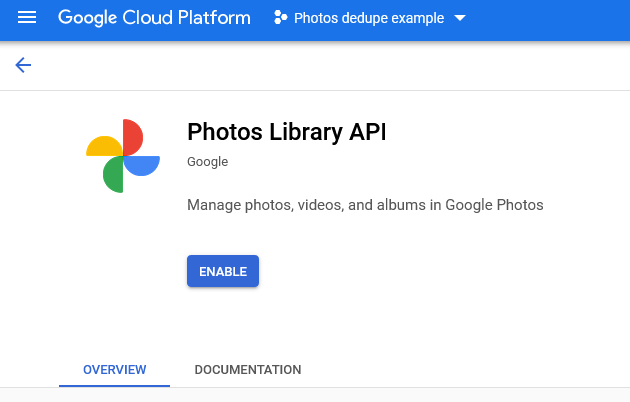
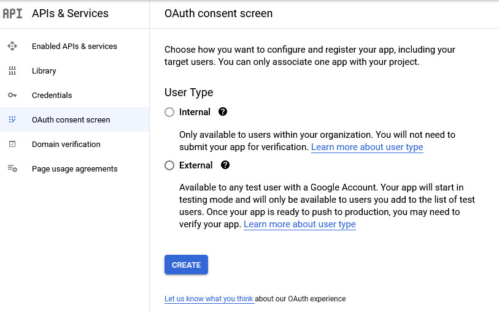
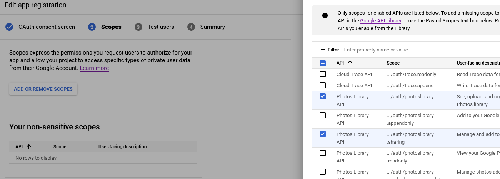
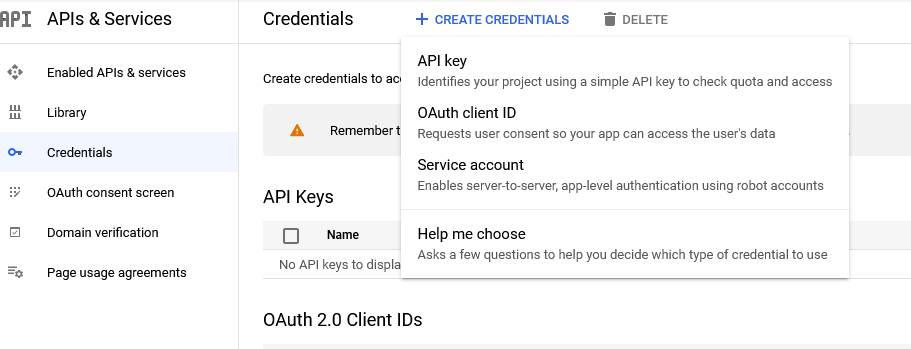
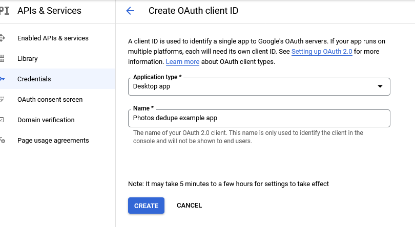
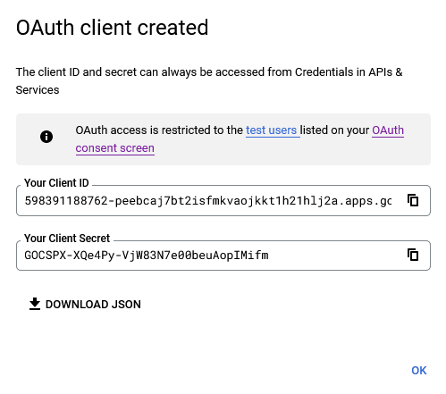

oI recently had a bit of a problem with the files that had ended up in Google Photos on my account: the Google Drive desktop synchronization app seemed to have noticed the many (reasonably-high-resolution) thumbnails that my local photo management application (Lightroom) creates, and had uploaded many near-duplicate images.

It seems this wasn't a problem with the old "[Backup and Sync](https://support.google.com/drive/answer/7638428?hl=en)" application because it supported excluding some files from backup (so I could have it ignore the directory that thumbnails get put into), but the new Drive application lacks such a feature.

While Google's sync tool does know how to avoid uploading exact duplicates of photos, it doesn't do any similarity matching on image content, so thumbnails (with the same content but lower resolution) and alternate formats (sidecar JPEGs that go along with camera raw files) end up duplicated in the Google Photos library. I have previously ignored the duplicates in alternate formats because they weren't too annoying, but when the sync tool uploaded a few thousand duplicate thumbnails I felt the need to do something about it.

## Existing programs

There aren't many existing options for managing duplicate items like this. Doing a web search for "Google Photos remove duplicates" mostly gives back content farm-style articles that talk about how Photos provides some duplicate-finding features (yes, but they're limited) and usually go on to suggest some nonfree application for finding duplicates on your local computer. These are all unhelpful because:

 * I don't have duplicates on my local computer, and want to clean up the duplicates in the Google library so it's easier to browse (and to save some space)
 * The official duplicate finding tool doesn't appear to look at visual similarity, so misses the thumbnails I want to remove
 * They're trying to sell me something that doesn't do what I want

I did discover [Rémi Mikel's duplicate finding tool](https://duplicates-google-photos.remikel.fr/) which seemed like a step in the right direction, but seemed to perform too badly to be very useful (probably because there are thousands of images that I want to get rid of, and it tries to display all of them in your browser). It did suggest an approach I could take to do this myself though, by using the public [Google Photos API](https://developers.google.com/photos/library/guides/overview).

## Rolling an API client

Using the public API is fairly straightforward; the most difficult part is probably in simply setting something up to be able to authenticate with my own credentials and access my photos. In the Google Cloud console, I created a project and enabled the [Photos Library API](https://console.cloud.google.com/apis/api/photoslibrary.googleapis.com/) for it, then created an OAuth client ID that I could use in my application. Since the steps are easier to illustrate than describe, here are screenshots of the process after having created a project.

* Enable the Photos Library API in the API library
  
  
* Create an OAuth consent screen for the application. This gets shown to users when providing the application access to the data in their Google account.
  * 

    This requires you to fill in an app name and some email addresses, but what exactly those are is up to you; they don't really matter if this project is only going to be for personal use, as it was in my case.
   * 

     When asked to select scopes for the app, select the relevant ones for the Photos Library API. `photoslibrary` and `photoslibrary.sharing` are sufficient for this use case. Any scopes that aren't enabled here won't be available to the application (permission will be denied) when run.

    * The third step adds users to the allowlist for a testing app, which is the default configuration. Non-testing apps are available to the public but may require review by Google before they can be published, but since this is for personal use on my own computer it's fine to let it stay as a test app. I added my own email address to the list of test users and continued on.

* Having configured the consent screen, we can now create a new OAuth client ID, in the API credentials page

  

  * 

    Set the Application type to Desktop and fill in a name. This program runs locally and is not a web application, so the type must be Desktop in order for the local authentication flow to be permitted.

   * 

     Download the JSON for the created client details after the client is created. The program will need to provide this to Google when logging in.